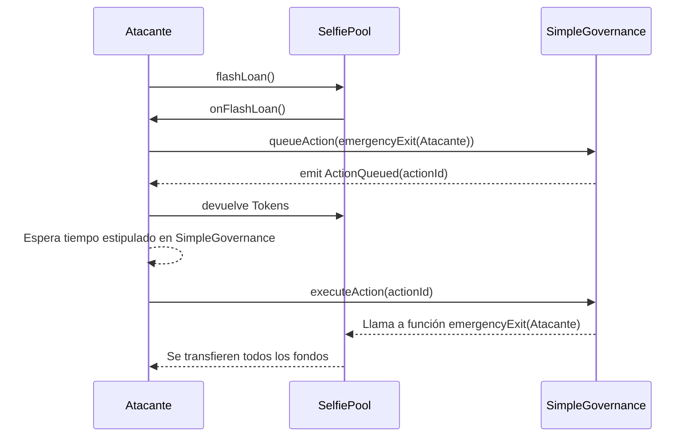

# Introducción

Este reporte se ha realizado sobre uno de los retos que podemos encontrar en la plataforma online [Damn Vulnerable DeFi](https://www.damnvulnerabledefi.xyz/) llamado [Selfie](https://www.damnvulnerabledefi.xyz/challenges/selfie/). Las instruciones del reto se pueden consultar en la siguiente imagen:


> [!NOTE]
> **Traducción:**
> 
> ¡Se ha lanzado una nueva bolsa de préstamos! Ahora ofrece préstamos flash de fichas DVT. Incluso incluye un elegante mecanismo de gobernanza para controlarlo.
>
> ¿Qué podría salir mal, verdad?
>
> Empiezas sin tokens DVT en el balance, y la piscina tiene 1,5 millones en riesgo.
>
> Rescata todos los fondos de la reserva y los deposita en la cuenta de recuperación designada.

Como podemos observar en este reto se ha implementado un sistema de préstamos flash (flash loans) junto con un mecanismo de governanza para controlarlo, además nos añaden que empezamos sin ningún token de balance y debemos mandar los 1.5 millones de token de la pisicina a una cuenta de recuperación.

# Apunte: Qué es una flash loan (O préstamo flash)

Para quién no este familiarizado con este concepto, un flash loan se puede definir como:

>[!NOTE]
>**Binance Academy**
>
> ¿Un préstamo concedido por extraños que no requiere que el usuario sacrifique parte de su propio dinero? Es posible, bajo una condición: los sujetos deben pagar al prestamista en el marco de la misma transacción que emitió los fondos. Suena extraño, ¿no es así? ¿Qué puedes hacer con un préstamo que debe ser devuelto segundos más tarde?
> 
> Pues bien, resulta que en esa misma transacción puedes realizar llamadas a smart contracts. Si puedes generar más dinero utilizando tu préstamo, podrás devolver el dinero y embolsarte el beneficio en un abrir y cerrar de ojos.

>[!NOTE]
>**Bit2me Academy**
>
>Un flash loan o préstamo flash no es más que un préstamo programado sobre un [**protocolo DeFi**](https://academy.bit2me.com/que-es-defi-o-finanzas-descentralizadas/), capaz de ofrecer una provisión de fondos a los usuarios sin que estos necesiten aportar una garantía (ni en criptomonedas, ni de ningún tipo) por los fondos que le son prestados. El protocolo DeFi brinda acceso al usuario de unos fondos para que éste pueda utilizarlos y devolverlos al protocolo en una misma operación, incluyendo las comisiones correspondientes.
>
>En blockchain esto es posible, porque existe la posibilidad de programar una transacción para que tome los fondos prestados, los movilice por distintos [**smart contracts**](https://academy.bit2me.com/que-son-los-smart-contracts/) de otros protocolos, se realicen las operaciones de intercambio pertinentes y, al final de esa misma transacción, el dinero del préstamo y sus comisiones sean reintegradas al protocolo inicial mientras el usuario se retira con sus ganancias.

>[!NOTE]
>**ChatGPT**
>
>Un _flash loan_ (o préstamo relámpago) es un tipo de préstamo que solo existe dentro de una única transacción en una blockchain como Ethereum. Permite a un usuario pedir prestados fondos sin necesidad de colateral, con la condición de que el préstamo sea devuelto en su totalidad dentro de la misma transacción. Si no se devuelve al final de la operación, la transacción completa se revierte automáticamente, como si nunca hubiera ocurrido.
>
>Este mecanismo es posible gracias a la forma en que funcionan los contratos inteligentes: todo el conjunto de operaciones debe completarse exitosamente, o ninguna tiene efecto. Los _flash loans_ se usan comúnmente para aprovechar oportunidades de arbitraje, refinanciar deudas, o mover fondos entre protocolos para optimizar rendimientos, pero también han sido explotados en ataques sofisticados si los protocolos no están bien diseñados.

De forma menos técnica se podría decir que un flash loan es un mecánismo donde un prestamista presta una cantidad de fondos (tokens habitualmente) a un prestatario a través de contratos inteligentes, con la particularidad de que el recibidor de los fondos puede hacer otras operaciones con esos fondos en la misma transacción y debe devolver dichos fondos después de usarlos junto a una comisión. Todo esto respaldado por un sistema descentralizado como es la blockchain.

# Análisis de nuestro reto

Bien definidos los conceptos del reto podemos pasar a realizar el análisis de los contratos proporcionados en el reto. Un resumen de los contratos sería el siguiente:

## Contrato `ISimpleGovernance.sol`

Este contrato consta de una interfaz donde se definen los elementos, eventos y funciones que van a ser implementadas en el contrato `SimpleGovernance.sol`, las funciones con las que se interactuará son las siguientes:


A priori nos vamos a interesar sobre las dos primeras funciones las cuales no tienen el tag `view` en su definición y por tanto pueden modificar el estado de la blockchain además de recibir o enviar fondos como es el caso de `executeAction()` la cual tiene el tag `payable`.

## Contrato `SimpleGovernance.sol`

Este contrato va a heredar la interfaz `ISimpleGovernance.sol` y definirá la implementación de las funciones arriba mencionadas. Vamos a destacar que este contrato importa otros dos contratos `DamnValuableVotes.sol` y `Address.sol` (OpenZeppelin) los cuales tendrán relevancia más tarde a la hora de explotar este sistema.

>[!IMPORTANT]
>**Variables del contrato**
>
>- **ACTION_DELAY_IN_SECONDS**: Constante privada usada para estimar un tiempo de espera para poder llamar a la función `executeAction()`
>- **_votingToken**: Variable privada de tipo `DamnValuableVotes` donde se manejarán los tokens prestados en `SelfiePool.sol`
>- **_actionCounter**: Variable privada que llevará la cuenta de las acciones ejecutadas por el contrato
>- **_actions**: Variable privada de tipo mapping donde se registrará para cada acción sus parámetros como el valor de la acción, a quién va dirigida y cuando se ejecutó, entre otros.

La función `queueAction()` va a comprobar si se tienen suficientes votos y asignará un id y los parámetros de la acción a las variables del contrato correspondientes, esta funcion no comprueba que acción se realizará por parte del usuario ni sobre quien se realizará.


La función complementaria a la anterior es `executeAction()`, aquí se va a comprobar si la acción se puede ejecutar según ciertos criterios (ver más abajo) y si este check pasa se procederá a realizar una transacción hacia la dirección asignada en `target` junto a los datos (normalmente la función del contrato que haya en `target`) y los fondos que se precisen.


Por último tenemos las dos funciones que controlarán cuando se puede ejecutar o poner en espera una acción, el foco de nuestro esfuerzo deberá estar en como bypassear estas dos restricciones para poder realizar acciones sobre el contrato `SelfiePool.sol` y obtener los fondos. La función `canBeExecuted()` no deja mucho margen de análisis, se podría intentar modificar el `timestamp` del bloque pero no es el camino más adecuado para explotar este contrato.

Sin embargo, en la segunda función, se comprueba si el tenedor de los votos (es decir nosotros) tiene al menos más de la mitad de los votos como para ejecutar una acción en el instante actual. Este camino parece más interesante porque como hemos dicho, en una flash loan se prestán ciertos votos o tokens durante un periodo de tiempo en el cual se pueden ejecutar otras acciones con esos votos.


## Contrato SelfiePool.sol

Por último llegamos al contrato donde se realizará la flash loan como tal, este contrato implementa otros dos contratos `IERC3156FlashLender.sol` y `ReentrancyGuard.sol` que nos ayudarán a implementar de forma más cómoda el mecanismo de la flash loan. En este contrato vamos a destacar las dos últimas funciones que son las partes más importantes de nuestro write-up.


En la primera función se realizará la transferencia de los tokens de la flash loan hacia el prestatario, a continuación se llamará a la función `_receiver.onFlashLoan()` del contrato que recibe los fondos con una comisión de 0 (se devolverá lo prestado sin comisión) y por último se devolverán los fondos prestados en la misma transacción.

La segunda función únicamente retirará todos los fondos de la pool si es llamada por el contrato `SimpleGovernance.sol` a modo de emergencia.

>[!IMPORTANT]
>**Resumen**
>
>Por lo tanto, tenemos un contrato que usaremos para mandar los fondos de la flash loan (`SelfiePool.sol`) y otro contrato que usaremos para realizar acciones de governanza sobre otros contratos (`SimpleGovernance.sol`) como en nuestro caso para limitar quien puede sacar todos los tokens de nuestra pool. Nuestro objetivo entonces será intentar combinar la funcionalidad de obtener los votos de la flash loan y en la misma transacción llamar al contrato de governanza para sacar todos los tokens de la SelfiePool a través de una acción legítima generada por el mismo contrato de governanza.

# Vulnerabilidad/es

Ya que tenemos una visión general de como funciona nuestro sistema podemos pasar al análisis de vulnerabilidades. En este tipo de sistemas de finanzas descentralizadas el punto de fallo común suele ser el sistema de votos o la manipulación de los precios de oráculos que se consultan a la hora de intercambiar tokens, véase ejemplos como [BeanStalk cryptocurrency project $182 million robbed](https://www.theverge.com/2022/4/18/23030754/beanstalk-cryptocurrency-hack-182-million-dao-voting) o [Cream Finance Hack](https://medium.com/@AndyPavia/swissblock-post-mortem-cream-finance-hack-7c1caff4335c) . Por ende vamos a buscar una forma de explotar el sistema de governanza de este servicio de flash loan.

El enfoque inicial que he tomado es investigar como funciona el contrato `DamnValuableVotes.sol` el cual implementa varios contratos de OpenZeppelin para el manejo de tokens a partir del estándar [ERC20](https://docs.openzeppelin.com/contracts/5.x/api/token/erc20) de OpenZeppelin y más concretamente de la extensión [ERC20Votes](https://docs.openzeppelin.com/contracts/5.x/api/token/erc20#ERC20Votes) la cual implementa un historial de checkpoints sobre cada poder de voto de cada cuenta, entre sus funciones podemos encontrar funciones para delegar el poder de voto con `Votes.delegate` y funciones para consultar el poder de voto como `Votes.getVotes` y `Votes.getPastVotes` como la que usa el contrato `SimpleGovernance.sol` para consultar los votos del usuario que quiere poner una acción en espera.


Si nos vamos a la declaración de estas funciones en el código de la librería que hemos importado veremos una diferencia sútil pero clave en este escenario.


>[!WARNING]
>**Diferencias**
>
>- Función `getVotes()`: Simplemente retorna la cantidad de votos que una cuenta tiene en ***el instante actual***
>- Función `getPastVotes()`: Retorna la cantidad de votos que una cuenta tenía en ***un momento específico del pasado***

Esta diferencia es el punto más importante del write-up debido a que la función que nos permite añadir una acción a nuestro sistema de governanza comprueba los votos actuales de una cuenta y no los votos que tenía hace por ejemplo uno o dos bloques atrás en el tiempo, si un atacante quisiera influir en nuestro sistema solamente debería obtener una cantidad superior a la mitad de los tokens que hay en la pool y después llamar a la función `queueAction()` asignando en el campo `data` del objeto acción cualquier llamada que desee, como por ejemplo una llamada a la función `emergencyExit(dirección Atacante)` consiguiendo drenar todos los fondos de la pool.
De forma más esquemática:



# Exploit

En el [github de DamnVulnerableDeFi](https://github.com/theredguild/damn-vulnerable-defi/tree/v4.1.0) podemos encontrar las reglas para subir nuestro exploit como un test de foundry, en este caso además del test de foundry vamos a necesitar un contrato atacante para llamar a las funciones de `SelfiePool` y `SimpleGovernance` que llamaremos de ahora en adelante `SelfieAttacker.sol`. Este contrato consta de lo siguiente:

Las variables de estado y el constructor los cuales inicializarán los contratos necesarios para poder llamar a `SelfiePool` y su sistema de gobernanza.


La función `initiateAttack()` que será la encargada de llamar al flashLoan con los parámetros necesarios para iniciar nuestro ataque.


La función `onFlashLoan()` la cual será llamada después de iniciar el ataque, al ejecutar esta función ya tendremos los tokens de votación asignados y podremos decidir que hacer con ellos antes de devolverlos.


Por último, la función `execute()` que llamará a la función `executeAction()` del contrato de gobernanza con el id devuelto al encolar la acción anteriormente.


### Test de foundry

En el test de foundry que debemos completar para probar si hemos explotado la vulnerabilidad debemos importar el contrato atacante y la implementación se haría dentro de la función `test_<nombre del reto>`, quedando en nuestro caso de la siguiente forma:


Si ejecutamos el siguiente comando dentro del proyecto podremos comprobar que nuestro exploit funciona correctamente:

```bash
forge test --mp test/selfie/Selfie.t.sol
```


# Mitigación/es

Como hemos visto en la sección anterior, hemos usado la función `getVotes` en vez de `getPastVotes` para obtener cuantos votos (tokens) tiene el usuario que quiere ejecutar una acción, por lo que cambiando esta línea sería a priori suficiente para mitigar esta vulnerabilidad, también es de mencionar que se debería notificar cada vez que se haga una delegación de votos para llevar una trazabilidad y poder tener más información sobre las acciones que se llevan a cabo por los usuarios.

La función corregida sería la siguiente:


Si ejecutamos de nuevo el test de foundry compilando el contrato con este cambio, comprobaremos que falla y nos asegura que el contrato atacante ya no tiene posibilidad de vaciar la pool.


Esto sería todo para este write-up sobre un reto muy interesante donde se puede ver de primera mano como un error a la hora de elegir una función u otra puede suponer perder millones de tokens y dejar expuestos a los usuarios legítimos de tu aplicación/servicio.
