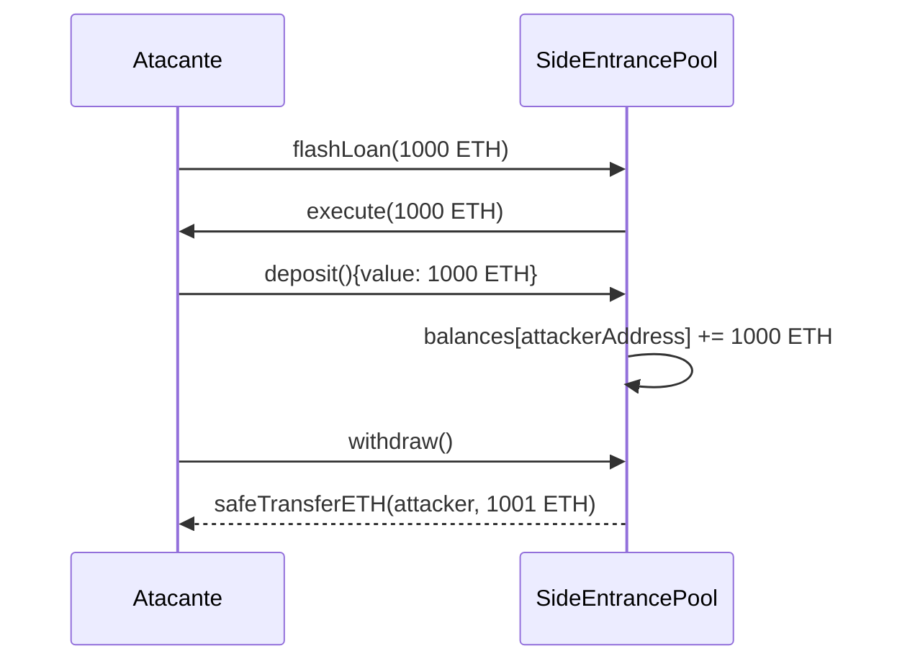

# Introducción

Este reporte se ha realizado sobre uno de los retos que podemos encontrar en la plataforma online [Damn Vulnerable DeFi](https://www.damnvulnerabledefi.xyz/) llamado [Side Entrance](https://www.damnvulnerabledefi.xyz/challenges/side-entrance/). Las instruciones del reto se pueden consultar en la siguiente imagen:


> [!NOTE]
> **Traducción:**
> Un pool sorprendentemente sencillo permite a cualquiera depositar ETH, y retirarlo en cualquier momento.
>
> Ya tiene 1000 ETH en saldo, y está ofreciendo flashloans gratuitos utilizando las ETH depositadas para promocionar su sistema.
>
> Empiezas con 1 ETH en saldo. Supera el reto rescatando todos los ETH del fondo común y depositándolos en la cuenta de recuperación designada.

No hay mucho más que decir de este reto, vamos a pasar directamente al análisis.

# Análisis de nuestro reto

Este reto consta de un solo contrato.

## Contrato `SideEntranceLenderPool.sol`

El único contrato de nuestro reto consta de 3 funciones, una función para depósitar ETH, otra función para sacar los fondos depósitados y una última función para _flash loans_. Vamos a analizarlas una por una:


La función `deposit` solo incrementa el valor del balance del _mapping_ de balances del contrato, si la cantidad de ETH que indiquemos en el `msg.value` es válida (tenemos dichos fondos) la función no revertirá. Por último mandará un evento para trazabilidad en la cadena de bloques (si estuviera desplegado).


La función `withdraw` obtendrá el balance del contrato o cuenta que ha llamado a la función del _mapping_ del contrato, reiniciará a cero el balance de esa dirección y nos enviará los fondos a través de un contrato seguro de transferencia de ETH (se supone que este contrato no es vulnerable).


Por último tenemos la función `flashLoan` que como su nombre indica va a llevar a cabo un flash loan a través de la interfaz `IFlashLoanEtherReceiver` la cual está definida más arriba. Si al terminar la función los fondos prestádos no se devuelven, la transacción revertirá.

# Análisis de vulnerabilidades

Habiendo definido las funciones del contrato vamos a pasar a analizar las posibles vulnerabilidades que se pueden encontrar. Primero me gustaría destacar las cosas positivas de este contrato, empezando por la función withdraw.

La función `withdraw` sigue en parte el patrón _check-effects-interact_ el cual consta en comprobar los valores con los que la función va a interactuar por si el usuario de la aplicación se ha equivocado o tiene intenciones maliciosas, justo después se efectua la modificación del estado del contrato modificando el _mapping_ de los balances y por último se interactúa con el contrato o la cuenta que llamó a la función ya sea enviando ETH o algún token. Esto es positivo ya que evitamos ataques de reentrada que explotan esto mismo, más información [aquí](https://scs.owasp.org/sctop10/SC05-Reentrancy/).


Otro punto positivo es el manejo de la _flash loan_, al no usar ningún token ERC20, solo ETH, solo debe comprobar el balance que había antes y después de prestar los fondos, lo cual es bastante sencillo y elegante a la vez. Si tuviera que poner alguna queja sería que la función no comprueba la reputación de quien llama a la función y no cobra ningún _fee_ a los usuarios pero eso no tiene que ser un problema muy grave.

Sin embargo este contrato tiene una vulnerabilidad sutil pero muy peligrosa, como ya sabemos las _flash loans_ prestán una cantidad de fondos a lo largo de una transacción cediendo el control de la transacción al recibidor de fondos, por lo que por un momento tenemos una cantidad de fondos (muchas veces desmesuradas) con la que podemos llamar a otras funciones e influir en su ejecución al tener estos fondos. Si nos fijamos en la función `deposit` como dijimos en su explicación lo único que lleva a cabo es el incremento del balance del usuario o contrato que llama a la función y para ello, solo necesitamos tener la cantidad suficiente de ETH para poder llamar a la función, **pero la función solo modifica el estado del contrato!!!**. Por lo tanto si conseguimos tener todos los fondos de la pool por un momento y llamamos a la función `deposit` con esos fondos, el contrato añadirá unos fondos que no son nuestros como si lo fueran en su estado. Por último, solo debemos hacer `withdraw()` y todos los fondos serán transferidos hacia nosotros. De forma más esquemática:



Con esto en mente vamos a pasar a la creación del contrato atacante que explotará la vulnerabilidad explicada anteriormente.

# Exploit/Ataque

Para explotar la vulnerabilidad vamos a crear un contrato atacante `SideEntranceAttacker.sol`, el cual constará de las siguientes funciones:


El contrato deberá tener un constructor con la dirección de la _pool_ víctima y la dirección de la cuenta _recovery_ a la que mandaremos los fondos al sacarlos de la _pool_.


La función `execute()` será llamada al llamar a `flashLoan()`, en este momento el contrato atacante tendrá todos los fondos de la _pool_ por lo que podemos llamar a `deposit()` con todos los fondos y no revertirá.


La función `executeAttack()` será la encargada de orquestar el ataque a través de los siguientes pasos:

- Obtenemos el balance de _pool_.
- Llamamos a `flashLoan()`.
- Llamamos a `withdraw()`, los fondos los tiene el contrato atacante.
- Mandamos los fondos a la cuenta _recovery_ para pasar el reto.

> [!IMPORTANT]
> **Nota: Para que el exploit funcione debemos importar el contrato de la _pool_ en el contrato atacante, añadir la interfaz `IFlashLoanEtherReceiver` e importar el contrato atacante en el test de foundry del reto.**

# Test de foundry

Para probar nuestro contrato atacante, debemos crear una instancia del mismo y llamar a la función `executeAttack()` que inciará el ataque, aquí una imagen del test en cuestión:


Para comprobar que el test pasa correctamente podemos ejecutar el siguiente comando por terminal en la carpeta de nuestro proyecto de damn-vulnerable-defi:

```bash
forge test --mp test/side-entrance/SideEntrance.t.sol
```

La salida del comando es la siguiente:


El test pasa y el reto ha sido completado!!

Otro reto completado donde hemos abordado otra vulnerabilidad de _flash loans_ mal implementados, que pueden resultar en la pérdida de todos los fondos de la _pool_ afectando seriamente a la reputación de nuestro servicio o a los fondos de nuestros usuarios.
